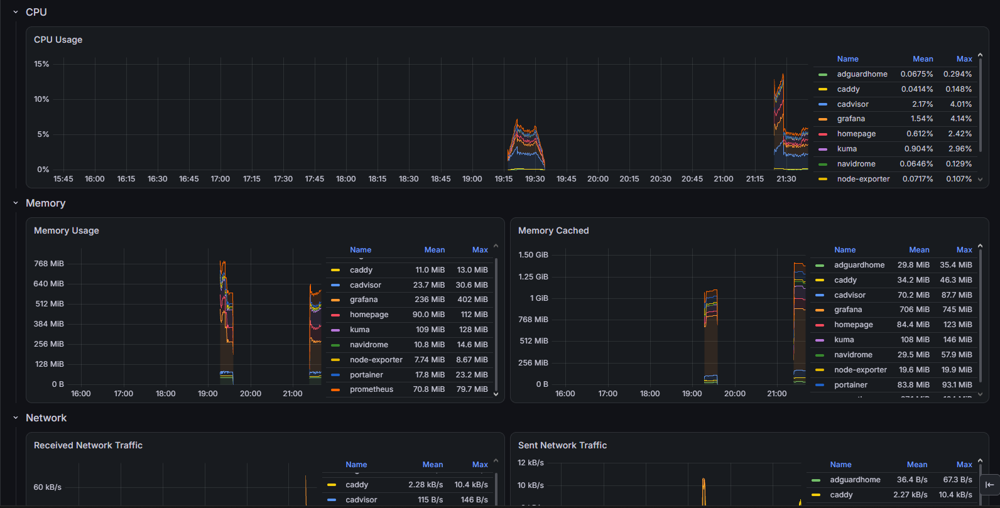
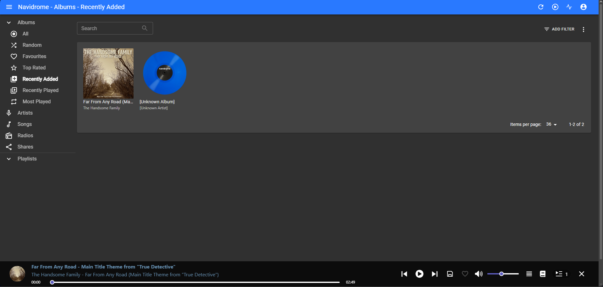

# 🏠 HomeLab — Self-Hosted Infrastructure & Monitoring

A personal **self-hosted homelab** built to practice Linux administration, Docker, networking, reverse proxies, DNS, monitoring, and infrastructure management.

The goal of this project is to build and maintain a small production-like environment where different services communicate through a controlled Docker network and are exposed through a reverse proxy.

> 🚧 **Project status:** Ongoing — additional services and improvements will be added over time.

---

## 📌 Overview

This homelab is currently running on an **Ubuntu Server virtual machine** and uses **Docker** to deploy and manage multiple infrastructure, monitoring, and self-hosted services.

The environment includes:

* 🐳 Docker
* 🛠️ Portainer
* 🌐 Caddy Reverse Proxy
* 🛡️ AdGuard Home
* 🏠 Homepage Dashboard
* 📈 Prometheus
* 📊 Grafana
* 🔔 Grafana Alerting (Discord notifications)
* 🟢 Uptime Kuma
* 🖥️ Node Exporter
* 📦 cAdvisor (container metrics)
* 🎵 Navidrome (self-hosted music streaming)

The project is designed to simulate a small infrastructure environment while providing hands-on experience with:

* Linux system administration
* Containerization
* Docker networking
* Reverse proxy configuration
* DNS and local service discovery
* Infrastructure monitoring
* Metrics collection (host and container level)
* Dashboard creation
* Service availability monitoring
* Alerting and notification pipelines
* Troubleshooting distributed services

---

# 🏗️ Architecture

The current environment follows a simple architecture:

```text
                         ┌─────────────────────┐
                         │     Ubuntu Server   │
                         │   VM (hostname:kali)│
                         └──────────┬──────────┘
                                    │
                                    ▼
                              ┌───────────┐
                              │   Docker  │
                              └─────┬─────┘
                                    │
              ┌─────────────────────┼─────────────────────┐
              │                     │                     │
              ▼                     ▼                     ▼
       ┌─────────────┐       ┌─────────────┐       ┌─────────────┐
       │   Caddy     │       │  Portainer  │       │  AdGuard    │
       │ Reverse     │       │   Docker    │       │    Home     │
       │   Proxy     │       │ Management  │       │    DNS      │
       └──────┬──────┘       └─────────────┘       └─────────────┘
              │
              │
      ┌───────┴──────────────────────────────────────────┐
      │                       │                          │
      ▼                       ▼                          ▼
┌─────────────┐        ┌─────────────┐            ┌─────────────┐
│  Homepage   │        │ Uptime Kuma │            │  Navidrome  │
│  Dashboard  │        │ Monitoring  │            │    Music    │
└─────────────┘        └─────────────┘            └─────────────┘

                    Monitoring Stack
                         │
        ┌────────────────┴────────────────┐
        │                                 │
        ▼                                 ▼
 ┌─────────────┐                   ┌─────────────┐
 │Node Exporter│                   │  cAdvisor   │
 │ Host Metrics│                   │  Container  │
 └──────┬──────┘                   │   Metrics   │
        │                          └──────┬──────┘
        └───────────────┬─────────────────┘
                        ▼
                 ┌─────────────┐
                 │ Prometheus  │
                 │   Metrics   │
                 └──────┬──────┘
                        │
                        ▼
                 ┌─────────────┐
                 │   Grafana   │
                 │ Dashboards  │
                 │ + Alerting  │
                 └──────┬──────┘
                        │
                        ▼
                 ┌─────────────┐
                 │   Discord   │
                 │   Webhook   │
                 │   Alerts    │
                 └─────────────┘

                    Backup (cron, daily @ 03:00)
                         │
                         ▼
                  ┌──────────────┐        SFTP        ┌────────────────────┐
                  │  backup.sh   │ ─────────────────► │  Lubuntu machine   │
                  │  (on kali)   │   restic, key-auth  │  (backupuser)      │
                  └──────────────┘                     │ /srv/backups/      │
                                                        │   homelab (restic  │
                                                        │   repository)      │
                                                        └────────────────────┘
```

---

# 🧰 Technologies

| Technology        | Purpose                              |
| ----------------- | ------------------------------------ |
| **Ubuntu Server** | Host operating system                |
| **Docker**        | Containerization platform            |
| **Portainer**     | Docker/container management          |
| **Caddy**         | Reverse proxy                        |
| **AdGuard Home**  | DNS and network-wide ad blocking     |
| **Homepage**      | Centralized service dashboard        |
| **Uptime Kuma**   | Service availability monitoring      |
| **Prometheus**    | Metrics collection and storage       |
| **Grafana**       | Metrics visualization and dashboards |
| **Grafana Alerting** | Alert rule evaluation and routing |
| **Discord Webhook** | Real-time alert notifications      |
| **Node Exporter** | Linux host metrics                   |
| **cAdvisor**      | Per-container CPU, memory, network and I/O metrics |
| **Navidrome**     | Self-hosted music streaming (Subsonic-compatible) |
| **restic**        | Encrypted, deduplicated backups      |

---

# 🐳 Docker Infrastructure

Docker is used as the primary containerization platform.

Each service runs independently inside its own container, allowing services to be:

* Started and stopped independently
* Updated without affecting the entire environment
* Connected through Docker networks
* Exposed through controlled ports
* Monitored individually

Docker networking is also used to allow containers to communicate with each other using Docker's internal DNS and container names.

---

# 📦 Docker Compose

All services are deployed as containers on a shared external Docker network (`homelab`), which lets them reach each other by container name (Docker's internal DNS) instead of relying on host IPs or exposed ports.

```yaml
services:
  adguardhome:
    image: adguard/adguardhome:latest
    container_name: adguardhome
    restart: unless-stopped
    ports:
      - "53:53/tcp"
      - "53:53/udp"
      - "3000:3000/tcp"
      - "8080:80/tcp"   # host 8080 -> container 80, avoids clash with Caddy on 80/443
    volumes:
      - ./adguard/work:/opt/adguardhome/work
      - ./adguard/conf:/opt/adguardhome/conf
    networks:
      - homelab

  caddy:
    image: caddy:latest
    container_name: caddy
    restart: unless-stopped
    ports:
      - "80:80"
      - "443:443"
    volumes:
      - ./caddy/Caddyfile:/etc/caddy/Caddyfile
      - ./caddy/data:/data
      - ./caddy/config:/config
    networks:
      - homelab

  node-exporter:
    image: prom/node-exporter:latest
    container_name: node-exporter
    restart: unless-stopped
    command:
      - "--path.rootfs=/host"
    volumes:
      - /:/host:ro
    networks:
      - homelab

  cadvisor:
    image: ghcr.io/google/cadvisor:v0.60.5   # v0.49.x can't see containers with Docker's containerd image store
    container_name: cadvisor
    restart: unless-stopped
    command:
      - "--docker_only=true"
      - "--housekeeping_interval=15s"
    devices:
      - /dev/kmsg
    volumes:
      - /:/rootfs:ro
      - /var/run:/var/run:ro
      - /sys:/sys:ro
      - /var/lib/docker/:/var/lib/docker:ro
      - /dev/disk/:/dev/disk:ro
    networks:
      - homelab

  navidrome:
    image: deluan/navidrome:latest
    container_name: navidrome
    restart: unless-stopped
    user: "1000:1000"
    environment:
      ND_LOGLEVEL: info
      ND_SESSIONTIMEOUT: 24h
    volumes:
      - ./navidrome/data:/data      # bind mount owned by UID 1000 (see troubleshooting)
      - ${MUSIC_PATH}:/music:ro     # music library, read-only
    networks:
      - homelab

  homepage:
    image: ghcr.io/gethomepage/homepage:latest
    container_name: homepage
    restart: unless-stopped
    ports:
      - "3001:3000"
    volumes:
      - ./homepage:/app/config
      - /var/run/docker.sock:/var/run/docker.sock:ro  
    environment:
      PUID: 1000
      PGID: 1000
      HOMEPAGE_ALLOWED_HOSTS: home.home
    networks:
      - homelab

  grafana:
    image: grafana/grafana:latest
    container_name: grafana
    restart: unless-stopped
    ports:
      - "3003:3000"
    environment:
      - GF_SECURITY_ADMIN_USER=${GRAFANA_ADMIN_USER}
      - GF_SECURITY_ADMIN_PASSWORD=${GRAFANA_ADMIN_PASSWORD}
    volumes:
      - grafana-data:/var/lib/grafana
    networks:
      - homelab

  prometheus:
    image: prom/prometheus:latest
    container_name: prometheus
    restart: unless-stopped
    ports:
      - "9091:9090"
    volumes:
      - prometheus-data:/prometheus
      - ./prometheus/prometheus.yml:/etc/prometheus/prometheus.yml:ro
    command:
      - "--config.file=/etc/prometheus/prometheus.yml"
    networks:
      - homelab

  portainer:
    image: portainer/portainer-ce:latest
    container_name: portainer
    restart: always
    command:
      - "--trusted-origins"
      - "${PORTAINER_TRUSTED_ORIGIN}"
    ports:
      - "8000:8000"
      - "9443:9443"
    volumes:
      - portainer_data:/data
      - /var/run/docker.sock:/var/run/docker.sock  
    networks:
      - homelab

  kuma:
    image: louislam/uptime-kuma:2
    container_name: kuma
    restart: unless-stopped
    ports:
      - "3002:3001"
    volumes:
      - kuma-data:/app/data   
    networks:
      - homelab

volumes:
  grafana-data:
  prometheus-data:
  portainer_data:
  kuma-data:

networks:
  homelab:
    external: true
```

### Configuration with `.env`

Secrets and machine-specific values are not hard-coded in the compose file. They are read from a `.env` file placed next to `docker-compose.yaml`, which is **excluded from Git** (`.gitignore`). The repository only contains a template, `.env.example`:

```env
# Grafana admin account (only applied on first start, when the database is created)
GRAFANA_ADMIN_USER=admin
GRAFANA_ADMIN_PASSWORD=change-me-to-a-long-random-password

# IP or hostname used to open Portainer in the browser
PORTAINER_TRUSTED_ORIGIN=192.168.x.x

# Absolute path of the music library mounted (read-only) in Navidrome
MUSIC_PATH=/home/youruser/music
```

> ⚠️ Copy `.env.example` to `.env` and set real values before deploying. Never commit `.env`, and never leave the placeholder password in a real deployment.
>
> For stacks deployed through **Portainer**, the host's `.env` file is not read: enter the same variables in the stack's *Environment variables* section instead.

### Deploying

```bash
cd docker
cp .env.example .env      # then edit .env with your own values
docker network create homelab   
docker compose up -d
```

The `Caddyfile` and `prometheus.yml` in this repo are starting points — adjust the `.home` hostnames and scrape targets to match your own network before deploying.

---

# 🌐 Reverse Proxy — Caddy

**Caddy** acts as the central reverse proxy for the homelab.

Instead of accessing services through different ports, services can be accessed through dedicated hostnames.

Example:

```text
home.home
portainer.home
adguard.home
kuma.home
prometheus.home
grafana.home
navidrome.home
```

The reverse proxy routes incoming requests to the appropriate Docker container.

Example architecture:

```text
Browser
   │
   ▼
Caddy
   │
   ├── home.home ──────────► Homepage
   │
   ├── portainer.home ─────► Portainer (HTTPS upstream, self-signed cert)
   │
   ├── adguard.home ───────► AdGuard Home
   │
   ├── kuma.home ──────────► Uptime Kuma
   │
   ├── prometheus.home ────► Prometheus
   │
   ├── grafana.home ───────► Grafana
   │
   └── navidrome.home ─────► Navidrome
```

Each site block uses the explicit `http://` prefix (for example `http://navidrome.home`). Without it, Caddy tries to obtain a public certificate for a `.home` name via automatic HTTPS, which cannot work for a local-only domain.

```text
http://navidrome.home {
    reverse_proxy navidrome:4533
}
```

This provides a cleaner and more realistic way of exposing internal services.

---

# 🛡️ DNS — AdGuard Home

AdGuard Home is used as the DNS server for the homelab.

Its main purposes are:

* Local DNS resolution (DNS rewrites map each `*.home` hostname to the Docker host)
* Network-wide ad blocking
* DNS request monitoring
* Centralized DNS configuration

It also provides a practical introduction to how DNS infrastructure works inside a local network.

---

# 📊 Monitoring Stack

The monitoring infrastructure is based on:

**Prometheus + Node Exporter + cAdvisor + Grafana + Grafana Alerting + Uptime Kuma**

### Prometheus

Prometheus collects and stores time-series metrics from monitored services.

The current configuration scrapes Prometheus itself, Node Exporter (host metrics) and cAdvisor (container metrics):

```yaml
scrape_configs:
  - job_name: prometheus
    static_configs:
      - targets: ['localhost:9090']

  - job_name: node
    static_configs:
      - targets: ['node-exporter:9100']

  - job_name: cadvisor
    static_configs:
      - targets: ['cadvisor:8080']
```

Prometheus uses a **15-second scrape interval**.

### Node Exporter

Node Exporter exposes Linux host-level metrics such as:

* CPU usage
* Memory usage
* Disk statistics
* Network statistics
* System load
* Filesystem information

### cAdvisor

cAdvisor exposes **per-container** resource metrics (CPU, memory, network, block I/O) with a `name` label for each Docker container, for example:

```text
container_memory_usage_bytes{name="navidrome"}
container_last_seen{name="grafana"}
```

It is not published on a host port: Prometheus reaches it through the shared `homelab` Docker network.

### Grafana

Grafana is used to visualize the metrics collected by Prometheus.

The goal is to create dashboards showing the health and performance of the homelab.

Example metrics include:

```text
CPU utilization
Memory utilization
Disk usage
Network traffic
System load
Per-container CPU and memory
Container/service health
```

### Uptime Kuma

Uptime Kuma is used to monitor service availability.

It allows the homelab to detect when a service becomes unavailable and provides an easy-to-read monitoring dashboard.

---

# 🔔 Alerting — Grafana + Discord Webhook

To move from passively viewing dashboards to actively being notified of problems, **Grafana Alerting** is configured with a **Discord webhook contact point**, so alerts are pushed directly to a Discord channel as soon as a rule fires.

### How it works

```text
Prometheus Metrics
        │
        ▼
Grafana Alert Rules (evaluated on a schedule)
        │
        ▼
  Condition met? ──► Firing
        │
        ▼
Grafana Contact Point (Discord Webhook)
        │
        ▼
  Discord Channel Notification
```

### Configuration

* Alerts are organized under a dedicated **"Homelab Alerts"** folder in Grafana
* A **Discord webhook URL** is configured as a contact point under Grafana → Alerting → Contact points
* Notification policies route firing alerts from the Homelab Alerts folder to the Discord contact point
* Each Discord message includes:
  * Alert name and current state (Firing/Resolved)
  * Query values
  * Labels (e.g. `instance`, `job`, `datasource_uid`, `name`)
  * Annotations (human-readable summary)
  * A direct link back to the alert rule in Grafana
  * A link to quickly silence the alert

### Example alert rules

| Alert Rule | Trigger Condition |
| ---------- | ------------------ |
| **Service Down** | Fires when a scrape target (e.g. `node-exporter:9100`) becomes unreachable |
| **Container down** | Fires when a container has not been seen by cAdvisor for more than 60 seconds: `time() - container_last_seen{name=~".+"} > 60` (1 minute pending period, one alert instance per container) |
| **DatasourceNoData** | Fires when a query (e.g. disk usage) returns no data, often indicating an upstream scraping issue |

### Why this matters

This setup demonstrates practical experience with:

* Configuring alert rules and evaluation intervals in Grafana
* Writing PromQL-based conditions that produce one alert per container
* Setting up contact points and notification policies
* Integrating external services (Discord) via webhooks
* Diagnosing alert conditions like `NoData` versus genuine threshold breaches
* Reducing reliance on manually checking dashboards by pushing alerts proactively

---

# 🎵 Navidrome — Self-Hosted Music Streaming

Navidrome is a lightweight, Subsonic-compatible music server, added as a service the homelab is actually used for day to day.

* Deployed as a Portainer stack on the shared `homelab` network
* Exposed only through Caddy at `navidrome.home` (no published host port)
* The music library is mounted **read-only** (`:ro`) so the server can never modify the files
* Works with Subsonic-compatible mobile apps (e.g. Symfonium, Substreamer)
* Library files are added by copying DRM-free music to the mounted folder (`scp`/`rsync`/WinSCP), then triggering a scan

---

# 💾 Backup & Disaster Recovery

To avoid a single point of failure, the homelab's configuration and persistent data are backed up off-host to a **separate physical machine** (a spare laptop running Lubuntu) using **restic** over SFTP.

### How it works

```text
kali (Docker host)
   │
   │  cron, daily @ 03:00
   ▼
backup.sh
   │
   ├── tar's Docker named volumes (grafana-data, prometheus-data,
   │     portainer_data, kuma-data) via a throwaway alpine container
   │
   └── restic backup ─────────────► Lubuntu machine (backupuser, SFTP)
                                          │
                                          ▼
                                    /srv/backups/homelab
                                    (encrypted restic repository)
```

### Setup

* Authentication is key-based SSH (ED25519), so backups run unattended with no password prompt
* The Lubuntu machine's IP is reserved via a DHCP static lease on the router, so it doesn't drift
* Config directories owned by root inside containers (AdGuard, Caddy) are made readable to the backup user via POSIX ACLs (`setfacl`), avoiding the need to run the backup script as root
* Retention policy: `--keep-daily 7 --keep-weekly 4 --keep-monthly 6`, pruned automatically after each run
* Scheduled via `cron`

### Verification

Backups are only useful if they can actually be restored — so a full backup → restore cycle was tested and verified, not just assumed to work.

**A scheduled backup run, picking up changes since the previous snapshot:**

```text
using parent snapshot de867408

Files:          16 new,     5 changed,    10 unmodified
Dirs:           17 new,    11 changed,     2 unmodified
Added to the repository: 4.786 MiB (1.523 MiB stored)

processed 31 files, 4.796 MiB in 0:04
snapshot 87031a48 saved
```

**Snapshot history, showing the retention policy applied correctly:**

```text
ID        Time                 Host    Paths                          Size
----------------------------------------------------------------------------
de867408  2026-09-03 15:16:24  kali    /home/kali/docker/adguard      35.219 KiB
                                        /home/kali/docker/caddy
                                        /home/kali/docker/homepage

87031a48  2026-09-03 15:17:43  kali    /home/kali/docker/adguard      4.796 MiB
                                        /home/kali/docker/caddy
                                        /home/kali/docker/homepage
----------------------------------------------------------------------------
3 snapshots
```

**Restore test — confirming the backup is actually recoverable, not just stored:**

```text
restoring snapshot 87031a48 [...] to /tmp/restore-test
Summary: Restored 57 files/dirs (4.796 MiB) in 0:01, skipped 4 files/dirs 348 B
```

### Lessons learned

* `restic` over SFTP needs a working `sftp-server` binary and an uncommented `Subsystem sftp` line in `sshd_config` on the target machine
* Running the backup script with `sudo` breaks path resolution (`~` resolves to `/root`) and uses root's SSH identity instead of the intended user's key — best avoided
* Root-owned files written by containers (AdGuard, Caddy) aren't readable by a regular user by default; `setfacl` with default ACLs solves this without loosening ownership or needing sudo for every backup run
* A DHCP reservation on the router keeps the backup target's IP stable, so the backup script and restic repository URL don't silently break after a router restart or lease renewal

---

# 🖼️ Screenshots

## 🏠 Homelab Dashboard


---

## 🐳 Portainer


---

## 🛡️ AdGuard Home


---

## 🌐 Caddy / Reverse Proxy


---

## 📈 Prometheus


---

## 📊 Grafana


---
## 🟢 Cadvisor exporter



---

## 🔔 Grafana Alerting (Discord)


---

## 🟢 Uptime Kuma


---


## 🎵 navidrome



---

# 🔧 Networking

The homelab uses Docker networks to control communication between services.

Services that need to communicate with Caddy are connected to a shared Docker network.

This allows Caddy to communicate with containers using their Docker DNS names instead of relying exclusively on host IP addresses.

Example:

```text
Caddy
  │
  ├── homepage:3000
  ├── adguardhome:80
  ├── kuma:3001
  ├── prometheus:9090
  ├── grafana:3000
  └── navidrome:4533
```

This setup provided practical experience troubleshooting:

* Docker DNS resolution
* Container-to-container communication
* Network membership
* Port conflicts
* Reverse proxy connectivity
* Service availability

---

# 🔍 Troubleshooting & Lessons Learned

One of the main objectives of this homelab is learning how to troubleshoot infrastructure problems instead of simply deploying applications.

Some issues encountered during the project included:

### Docker Networking

Containers were initially distributed across different Docker networks, which caused connectivity problems between services.

This required investigating container network membership and ensuring that services that needed to communicate were connected to the appropriate network.

For example, Grafana and Prometheus were initially deployed via Portainer stacks that omitted the `networks:` block, so Docker placed them on auto-created default networks (`grafana_default`, `prometheus_default`) instead of the shared `homelab` network. This was caught by comparing `docker network inspect homelab` against `docker ps`, then fixed by adding an explicit `networks: [homelab]` entry (with `homelab` declared as `external: true`) to each stack's compose definition in Portainer's Editor and redeploying.

### Persistent Data

Auditing each container's config with `docker inspect` also surfaced that Uptime Kuma had no volume mounted at all — all monitors and history were living only in the container's writable layer, meaning a container recreation would have wiped them. This was fixed by adding a named volume (`kuma-data:/app/data`) to the compose definition, a good reminder to check `Mounts` on every service rather than assuming persistence is in place just because a container has been running fine.

### Reverse Proxy Issues

Caddy initially returned errors when it could not resolve certain Docker container names.

This demonstrated the importance of understanding Docker's internal DNS and network isolation.

A later **502 Bad Gateway** on `navidrome.home` looked like a Caddy problem but was not: the DNS record and the Caddyfile were correct, and the upstream container was crash-looping. Checking `docker ps -a` and `docker logs` first (instead of editing the proxy config) found the real cause in a few seconds. Two other Caddy details worth remembering: local `.home` sites need the explicit `http://` prefix to avoid automatic HTTPS, and an HTTPS upstream such as Portainer needs `tls_insecure_skip_verify` because of its self-signed certificate.

### Container Permissions (Navidrome)

Navidrome crash-looped at startup with `unable to open database file: no such file or directory`, even though the message suggests a missing path. The real cause was permissions: a Docker named volume is created owned by `root`, while the container ran as `user: "1000:1000"`, so it could not create its SQLite database in `/data`. The fix was to use a bind-mounted directory owned by UID 1000 instead of a root-owned named volume, keeping the container unprivileged.

### cAdvisor and Docker's containerd image store

cAdvisor v0.49.1 started and answered scrapes, but logged `failed to identify the read-write layer ID` for every container, and no metric carried a `name` label, so all per-container dashboards would have been empty. The cause: Docker's containerd image store no longer keeps the `layerdb/mounts/<id>/mount-id` files that older cAdvisor versions read. Upgrading to a recent release (v0.60.5, published on `ghcr.io`) fixed it. After the upgrade, `container_memory_usage_bytes{name!=""}` returned one series per container. The lesson: a target showing **UP** in Prometheus only proves the scrape works, not that the data is useful, so always query the metrics themselves.

### Port Conflicts

Some services attempted to use ports that were already occupied by other applications.

For example, Prometheus and other services required checking which ports were already in use before deployment.

### Monitoring Troubleshooting

Prometheus successfully connected to Node Exporter, but some PromQL queries initially returned no data.

This led to investigating:

* Prometheus targets
* Scrape configuration
* Exporter availability
* Labels
* Job names
* Docker networking
* PromQL queries

Another detail: after editing `prometheus.yml`, all targets briefly showed `unknown / never scraped` until the first 15-second scrape completed, and it is important to edit the file that the container actually mounts (the bind-mount path in the stack definition), not another copy of it.

### Alerting Troubleshooting

Setting up Grafana Alerting surfaced additional issues to debug, including:

* `DatasourceNoData` firing when an exporter target went down, rather than the underlying metric genuinely crossing a threshold
* Making sure alert rule labels (`instance`, `job`, `datasource_uid`) were specific enough to identify the exact failing component
* Verifying the Discord webhook contact point delivered notifications correctly and that notification policies routed alerts from the right folder
* Building the container alert on `container_last_seen`: once a container stops, its series eventually disappears from Prometheus, so the rule's no-data handling has to be set deliberately to keep the alert firing instead of silently going to `NoData`

These problems provided practical experience debugging a monitoring and alerting stack rather than simply following a deployment tutorial.

---

# 📚 Skills Demonstrated

Through this project, I developed practical experience with:

### Linux

* Ubuntu Server administration
* Services and processes
* Networking
* System troubleshooting
* File and configuration management
* File ownership and permissions

### Docker

* Container deployment
* Docker Compose / stacks
* Container networking
* Port mapping
* Docker DNS
* Container troubleshooting
* Bind mounts vs named volumes
* Reading container logs to diagnose crash loops

### Networking

* DNS
* Reverse proxies
* HTTP/HTTPS
* Local service discovery
* Port management
* Network isolation

### Monitoring & Alerting

* Prometheus
* PromQL
* Grafana
* Grafana Alerting (rules, contact points, notification policies)
* Discord webhook integration
* Node Exporter
* cAdvisor and container-level monitoring
* Uptime monitoring
* Metrics and alert troubleshooting

### Infrastructure

* Self-hosted services
* Service management
* Infrastructure organization
* Monitoring and observability
* Troubleshooting distributed services
* Backup and restore validation

---

# 🚀 Future Improvements

The homelab is an ongoing project.

Planned improvements include:

* [ ] Add additional DNS/networking services
* [ ] Improve Grafana dashboards
* [x] Add more Prometheus exporters (cAdvisor)
* [x] Monitor Docker containers (cAdvisor + Grafana)
* [ ] Add centralized logging
* [x] Implement automated backups (restic → off-host Lubuntu machine, restore-tested)
* [ ] Improve Docker network architecture
* [x] Add alerting (Grafana Alerting → Discord webhook)
* [ ] Expand alerting coverage (container health ✅, certificate expiry ⏳)
* [ ] Add HTTPS certificates where appropriate
* [x] Automate deployments with Docker Compose
* [ ] Add a dedicated NAS/storage service
* [ ] Add a Git-based CI/CD workflow
* [ ] Document infrastructure configuration
* [ ] Expand the environment with additional virtual machines

---

# 🎯 Project Goals

The main purpose of this homelab is to gain practical experience with technologies commonly used in modern IT infrastructure and DevOps environments.

Rather than only learning these technologies theoretically, the project provides hands-on experience with:

```text
Deploy
   ↓
Configure
   ↓
Connect
   ↓
Monitor
   ↓
Alert
   ↓
Troubleshoot
   ↓
Improve
```

The environment is continuously evolving as new technologies and services are tested.

---

# 📁 Repository Structure

```text
homelab/
│
├── README.md
├── .gitignore          # excludes docker/.env
│
├── images/
│   ├── homepage.png
│   ├── portainer.png
│   ├── adguard.png
│   ├── caddy.png
│   ├── prometheus.png
│   ├── grafana.png
│   ├── discord-alerts.png
│   └── uptime-kuma.png
│
├── docker/
│   ├── docker-compose.yaml
│   ├── .env.example
│   ├── adguard/
│   │   ├── work/
│   │   └── conf/
│   ├── caddy/
│   │   ├── Caddyfile
│   │   ├── data/
│   │   └── config/
│   ├── homepage/
│   ├── navidrome/
│   │   └── data/
│   └── prometheus/
│       └── prometheus.yml
│
└── documentation/
    └── notes.md
```

---

# 📈 Status

| Component        | Status     |
| ----------------- | ---------- |
| Ubuntu Server     | 🟢 Running |
| Docker            | 🟢 Running |
| Portainer         | 🟢 Running |
| Caddy             | 🟢 Running |
| AdGuard Home      | 🟢 Running |
| Homepage          | 🟢 Running |
| Uptime Kuma       | 🟢 Running |
| Prometheus        | 🟢 Running |
| Grafana           | 🟢 Running |
| Grafana Alerting → Discord | 🟢 Running |
| Node Exporter     | 🟢 Running |
| cAdvisor          | 🟢 Running |
| Navidrome         | 🟢 Running |
| Backups (restic → Lubuntu) | 🟢 Running |

---

# 👨‍💻 Author

**Abdellah El Berdai**

Networking & Cybersecurity engineering student
Morocco

This homelab is a personal infrastructure project created to develop practical skills in **Linux, Docker, networking, monitoring, and infrastructure administration**.

---

⭐ If you find this project useful, feel free to explore the repository and follow its development.
