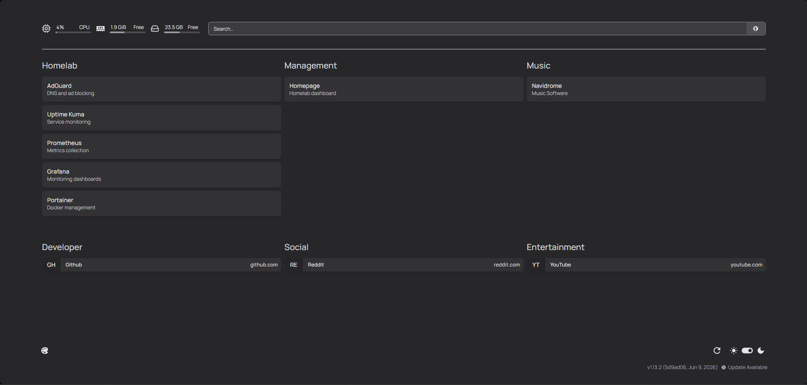
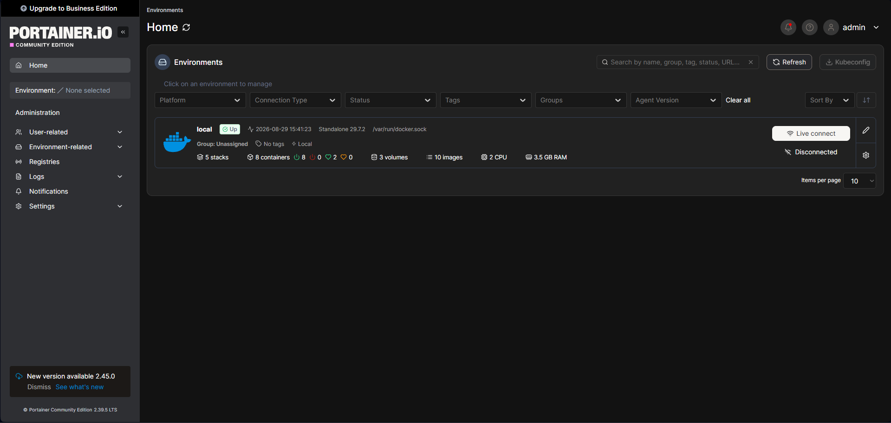
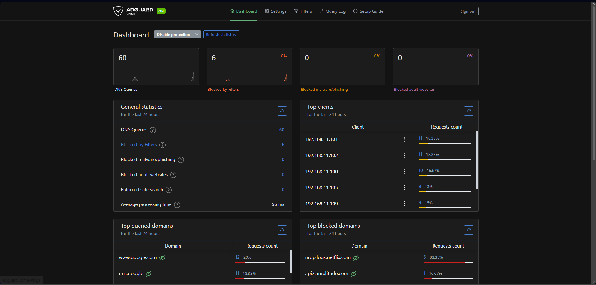
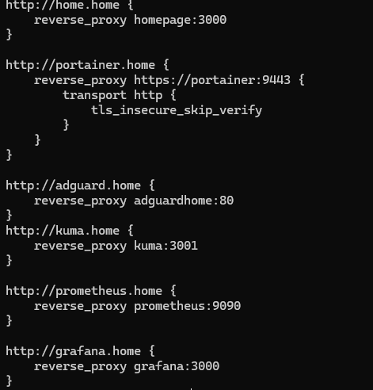
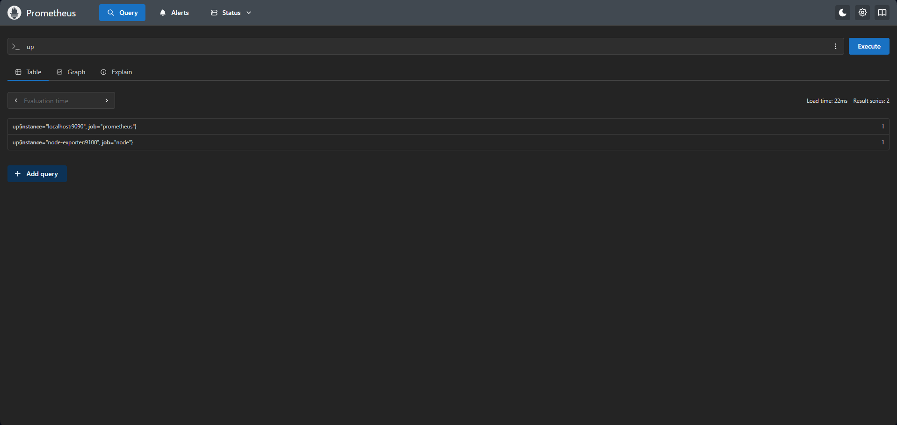
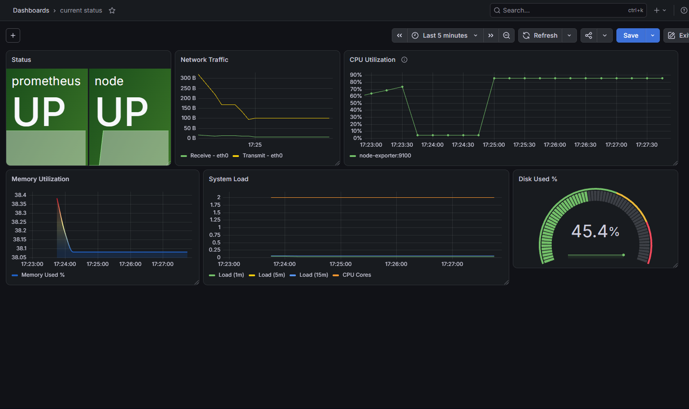
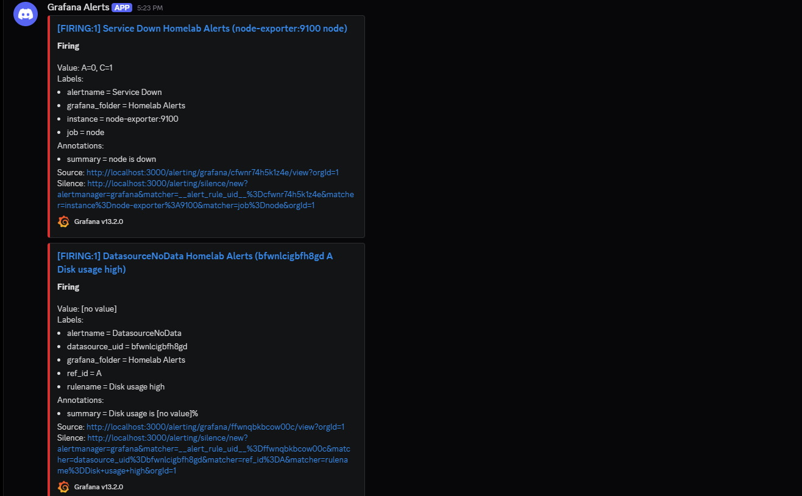
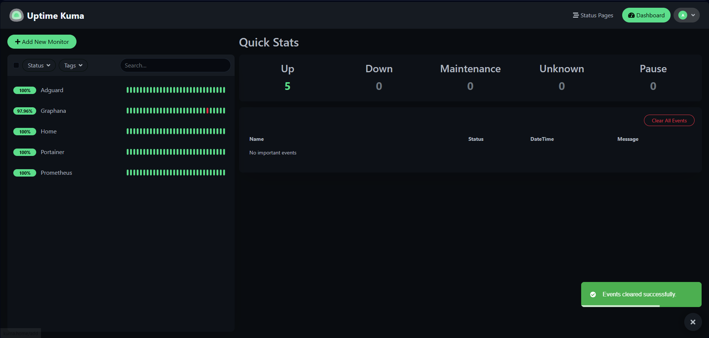

# 🏠 HomeLab — Self-Hosted Infrastructure & Monitoring

A personal **self-hosted homelab** built to practice Linux administration, Docker, networking, reverse proxies, DNS, monitoring, and infrastructure management.

The goal of this project is to build and maintain a small production-like environment where different services communicate through a controlled Docker network and are exposed through a reverse proxy.

> 🚧 **Project status:** Ongoing — additional services and improvements will be added over time.

---

## 📌 Overview

This homelab is currently running on an **Ubuntu Server virtual machine** and uses **Docker** to deploy and manage multiple infrastructure and monitoring services.

The environment includes:

* 🐳 Docker
* 🛠️ Portainer
* 🌐 Caddy Reverse Proxy
* 🛡️ AdGuard Home
* 🏠 Homepage Dashboard
* 📈 Prometheus
* 📊 Grafana
* 🔔 Grafana Alerting (Discord notifications)
* 🟢 Uptime Kuma
* 🖥️ Node Exporter

The project is designed to simulate a small infrastructure environment while providing hands-on experience with:

* Linux system administration
* Containerization
* Docker networking
* Reverse proxy configuration
* DNS and local service discovery
* Infrastructure monitoring
* Metrics collection
* Dashboard creation
* Service availability monitoring
* Alerting and notification pipelines
* Troubleshooting distributed services

---

# 🏗️ Architecture

The current environment follows a simple architecture:

```text
                         ┌─────────────────────┐
                         │     Ubuntu Server   │
                         │        VM           │
                         └──────────┬──────────┘
                                    │
                                    ▼
                              ┌───────────┐
                              │   Docker  │
                              └─────┬─────┘
                                    │
              ┌─────────────────────┼─────────────────────┐
              │                     │                     │
              ▼                     ▼                     ▼
       ┌─────────────┐       ┌─────────────┐       ┌─────────────┐
       │   Caddy     │       │  Portainer  │       │  AdGuard    │
       │ Reverse     │       │   Docker    │       │    Home     │
       │   Proxy     │       │ Management  │       │    DNS      │
       └──────┬──────┘       └─────────────┘       └─────────────┘
              │
              │
      ┌───────┴──────────────────────────────────┐
      │                                          │
      ▼                                          ▼
┌─────────────┐                          ┌─────────────┐
│  Homepage   │                          │ Uptime Kuma │
│  Dashboard  │                          │ Monitoring  │
└─────────────┘                          └─────────────┘

                    Monitoring Stack
                         │
             ┌───────────┴───────────┐
             │                       │
             ▼                       ▼
      ┌─────────────┐         ┌─────────────┐
      │ Prometheus  │◄────────│Node Exporter│
      │   Metrics   │         │ Host Metrics│
      └──────┬──────┘         └─────────────┘
             │
             ▼
      ┌─────────────┐
      │   Grafana   │
      │ Dashboards  │
      │ + Alerting  │
      └──────┬──────┘
             │
             ▼
      ┌─────────────┐
      │   Discord   │
      │   Webhook   │
      │   Alerts    │
      └─────────────┘
```

---

# 🧰 Technologies

| Technology        | Purpose                              |
| ----------------- | ------------------------------------ |
| **Ubuntu Server** | Host operating system                |
| **Docker**        | Containerization platform            |
| **Portainer**     | Docker/container management          |
| **Caddy**         | Reverse proxy                        |
| **AdGuard Home**  | DNS and network-wide ad blocking     |
| **Homepage**      | Centralized service dashboard        |
| **Uptime Kuma**   | Service availability monitoring      |
| **Prometheus**    | Metrics collection and storage       |
| **Grafana**       | Metrics visualization and dashboards |
| **Grafana Alerting** | Alert rule evaluation and routing |
| **Discord Webhook** | Real-time alert notifications      |
| **Node Exporter** | Linux host metrics                   |

---

# 🐳 Docker Infrastructure

Docker is used as the primary containerization platform.

Each service runs independently inside its own container, allowing services to be:

* Started and stopped independently
* Updated without affecting the entire environment
* Connected through Docker networks
* Exposed through controlled ports
* Monitored individually

Docker networking is also used to allow containers to communicate with each other using Docker's internal DNS and container names.

---

# 📦 Docker Compose

All services are deployed as containers on a shared external Docker network (`homelab`), which lets them reach each other by container name (Docker's internal DNS) instead of relying on host IPs or exposed ports.

```yaml
services:
  adguardhome:
    image: adguard/adguardhome:latest
    container_name: adguardhome
    restart: unless-stopped
    ports:
      - "53:53/tcp"
      - "53:53/udp"
      - "3000:3000/tcp"
      - "8080:80/tcp"   # host 8080 -> container 80, avoids clash with Caddy on 80/443
    volumes:
      - ./adguard/work:/opt/adguardhome/work
      - ./adguard/conf:/opt/adguardhome/conf
    networks:
      - homelab

  caddy:
    image: caddy:latest
    container_name: caddy
    restart: unless-stopped
    ports:
      - "80:80"
      - "443:443"
    volumes:
      - ./caddy/Caddyfile:/etc/caddy/Caddyfile
      - ./caddy/data:/data
      - ./caddy/config:/config
    networks:
      - homelab

  node-exporter:
    image: prom/node-exporter:latest
    container_name: node-exporter
    restart: unless-stopped
    command:
      - "--path.rootfs=/host"
    volumes:
      - /:/host:ro
    networks:
      - homelab

  homepage:
    image: ghcr.io/gethomepage/homepage:latest
    container_name: homepage
    restart: unless-stopped
    ports:
      - "3001:3000"
    volumes:
      - ./homepage:/app/config
      - /var/run/docker.sock:/var/run/docker.sock:ro  
    environment:
      PUID: 1000
      PGID: 1000
      HOMEPAGE_ALLOWED_HOSTS: home.home
    networks:
      - homelab

  grafana:
    image: grafana/grafana:latest
    container_name: grafana
    restart: unless-stopped
    ports:
      - "3003:3000"
    environment:
      - GF_SECURITY_ADMIN_USER=
      - GF_SECURITY_ADMIN_PASSWORD=  
    volumes:
      - grafana-data:/var/lib/grafana
    networks:
      - homelab

  prometheus:
    image: prom/prometheus:latest
    container_name: prometheus
    restart: unless-stopped
    ports:
      - "9091:9090"
    volumes:
      - prometheus-data:/prometheus
      - ./prometheus/prometheus.yml:/etc/prometheus/prometheus.yml:ro
    command:
      - "--config.file=/etc/prometheus/prometheus.yml"
    networks:
      - homelab

  portainer:
    image: portainer/portainer-ce:latest
    container_name: portainer
    restart: always
    command:
      - "--trusted-origins"
      - "192.168.x.x"   
    ports:
      - "8000:8000"
      - "9443:9443"
    volumes:
      - portainer_data:/data
      - /var/run/docker.sock:/var/run/docker.sock  
    networks:
      - homelab

  kuma:
    image: louislam/uptime-kuma:2
    container_name: kuma
    restart: unless-stopped
    ports:
      - "3002:3001"
    volumes:
      - kuma-data:/app/data   
    networks:
      - homelab

volumes:
  grafana-data:
  prometheus-data:
  portainer_data:
  kuma-data:

networks:
  homelab:
    external: true
```

> ⚠️ Replace the placeholder Grafana password and Portainer trusted-origin IP above with your own values before deploying — don't leave `changeme` or `192.168.x.x` in a real deployment.

### Deploying

```bash
cd docker
docker network create homelab   
docker compose up -d
```

The `Caddyfile` and `prometheus.yml` in this repo are starting points — adjust the `.home` hostnames and scrape targets to match your own network before deploying.

---


# 🌐 Reverse Proxy — Caddy

**Caddy** acts as the central reverse proxy for the homelab.

Instead of accessing services through different ports, services can be accessed through dedicated hostnames.

Example:

```text
homepage.home
portainer.home
adguardhome.home
kuma.home
prometheus.home
grafana.home
```

The reverse proxy routes incoming requests to the appropriate Docker container.

Example architecture:

```text
Browser
   │
   ▼
Caddy
   │
   ├── homepage.home ──────► Homepage
   │
   ├── portainer.home ─────► Portainer
   │
   ├── adguardhome.home ───► AdGuard Home
   │
   ├── kuma.home ──────────► Uptime Kuma
   │
   ├── prometheus.home ────► Prometheus
   │
   └── grafana.home ───────► Grafana
```

This provides a cleaner and more realistic way of exposing internal services.

---

# 🛡️ DNS — AdGuard Home

AdGuard Home is used as the DNS server for the homelab.

Its main purposes are:

* Local DNS resolution
* Network-wide ad blocking
* DNS request monitoring
* Centralized DNS configuration

It also provides a practical introduction to how DNS infrastructure works inside a local network.

---

# 📊 Monitoring Stack

The monitoring infrastructure is based on:

**Prometheus + Node Exporter + Grafana + Grafana Alerting + Uptime Kuma**

### Prometheus

Prometheus collects and stores time-series metrics from monitored services.

The current configuration includes Prometheus itself and a Node Exporter target.

Example target:

```text
node-exporter:9100
```

Prometheus uses a **15-second scrape interval**.

### Node Exporter

Node Exporter exposes Linux host-level metrics such as:

* CPU usage
* Memory usage
* Disk statistics
* Network statistics
* System load
* Filesystem information

### Grafana

Grafana is used to visualize the metrics collected by Prometheus.

The goal is to create dashboards showing the health and performance of the homelab.

Example metrics include:

```text
CPU utilization
Memory utilization
Disk usage
Network traffic
System load
Container/service health
```

### Uptime Kuma

Uptime Kuma is used to monitor service availability.

It allows the homelab to detect when a service becomes unavailable and provides an easy-to-read monitoring dashboard.

---

# 🔔 Alerting — Grafana + Discord Webhook

To move from passively viewing dashboards to actively being notified of problems, **Grafana Alerting** is configured with a **Discord webhook contact point**, so alerts are pushed directly to a Discord channel as soon as a rule fires.

### How it works

```text
Prometheus Metrics
        │
        ▼
Grafana Alert Rules (evaluated on a schedule)
        │
        ▼
  Condition met? ──► Firing
        │
        ▼
Grafana Contact Point (Discord Webhook)
        │
        ▼
  Discord Channel Notification
```

### Configuration

* Alerts are organized under a dedicated **"Homelab Alerts"** folder in Grafana
* A **Discord webhook URL** is configured as a contact point under Grafana → Alerting → Contact points
* Notification policies route firing alerts from the Homelab Alerts folder to the Discord contact point
* Each Discord message includes:
  * Alert name and current state (Firing/Resolved)
  * Query values
  * Labels (e.g. `instance`, `job`, `datasource_uid`)
  * Annotations (human-readable summary)
  * A direct link back to the alert rule in Grafana
  * A link to quickly silence the alert

### Example alert rules

| Alert Rule | Trigger Condition |
| ---------- | ------------------ |
| **Service Down** | Fires when a scrape target (e.g. `node-exporter:9100`) becomes unreachable |
| **DatasourceNoData** | Fires when a query (e.g. disk usage) returns no data, often indicating an upstream scraping issue |

### Why this matters

This setup demonstrates practical experience with:

* Configuring alert rules and evaluation intervals in Grafana
* Setting up contact points and notification policies
* Integrating external services (Discord) via webhooks
* Diagnosing alert conditions like `NoData` versus genuine threshold breaches
* Reducing reliance on manually checking dashboards by pushing alerts proactively

---

# 🖼️ Screenshots

Screenshots will be added here to document the actual environment.

## 🏠 Homelab Dashboard



---

## 🐳 Portainer



---

## 🛡️ AdGuard Home



---

## 🌐 Caddy / Reverse Proxy



---

## 📈 Prometheus



---

## 📊 Grafana



---

## 🔔 Grafana Alerting (Discord)



---

## 🟢 Uptime Kuma



---

# 🔧 Networking

The homelab uses Docker networks to control communication between services.

Services that need to communicate with Caddy are connected to a shared Docker network.

This allows Caddy to communicate with containers using their Docker DNS names instead of relying exclusively on host IP addresses.

Example:

```text
Caddy
  │
  ├── homepage:3000
  ├── adguardhome:80
  ├── kuma:3001
  ├── prometheus:9090
  └── grafana:3000
```

This setup provided practical experience troubleshooting:

* Docker DNS resolution
* Container-to-container communication
* Network membership
* Port conflicts
* Reverse proxy connectivity
* Service availability

---

# 🔍 Troubleshooting & Lessons Learned

One of the main objectives of this homelab is learning how to troubleshoot infrastructure problems instead of simply deploying applications.

Some issues encountered during the project included:

### Docker Networking

Containers were initially distributed across different Docker networks, which caused connectivity problems between services.

This required investigating container network membership and ensuring that services that needed to communicate were connected to the appropriate network.

For example, Grafana and Prometheus were initially deployed via Portainer stacks that omitted the `networks:` block, so Docker placed them on auto-created default networks (`grafana_default`, `prometheus_default`) instead of the shared `homelab` network. This was caught by comparing `docker network inspect homelab` against `docker ps`, then fixed by adding an explicit `networks: [homelab]` entry (with `homelab` declared as `external: true`) to each stack's compose definition in Portainer's Editor and redeploying.

### Persistent Data

Auditing each container's config with `docker inspect` also surfaced that Uptime Kuma had no volume mounted at all — all monitors and history were living only in the container's writable layer, meaning a container recreation would have wiped them. This was fixed by adding a named volume (`kuma-data:/app/data`) to the compose definition, a good reminder to check `Mounts` on every service rather than assuming persistence is in place just because a container has been running fine.

### Reverse Proxy Issues

Caddy initially returned errors when it could not resolve certain Docker container names.

This demonstrated the importance of understanding Docker's internal DNS and network isolation.

### Port Conflicts

Some services attempted to use ports that were already occupied by other applications.

For example, Prometheus and other services required checking which ports were already in use before deployment.

### Monitoring Troubleshooting

Prometheus successfully connected to Node Exporter, but some PromQL queries initially returned no data.

This led to investigating:

* Prometheus targets
* Scrape configuration
* Exporter availability
* Labels
* Job names
* Docker networking
* PromQL queries

### Alerting Troubleshooting

Setting up Grafana Alerting surfaced additional issues to debug, including:

* `DatasourceNoData` firing when an exporter target went down, rather than the underlying metric genuinely crossing a threshold
* Making sure alert rule labels (`instance`, `job`, `datasource_uid`) were specific enough to identify the exact failing component
* Verifying the Discord webhook contact point delivered notifications correctly and that notification policies routed alerts from the right folder

These problems provided practical experience debugging a monitoring and alerting stack rather than simply following a deployment tutorial.

---

# 📚 Skills Demonstrated

Through this project, I developed practical experience with:

### Linux

* Ubuntu Server administration
* Services and processes
* Networking
* System troubleshooting
* File and configuration management

### Docker

* Container deployment
* Docker Compose / stacks
* Container networking
* Port mapping
* Docker DNS
* Container troubleshooting

### Networking

* DNS
* Reverse proxies
* HTTP/HTTPS
* Local service discovery
* Port management
* Network isolation

### Monitoring & Alerting

* Prometheus
* PromQL
* Grafana
* Grafana Alerting (rules, contact points, notification policies)
* Discord webhook integration
* Node Exporter
* Uptime monitoring
* Metrics and alert troubleshooting

### Infrastructure

* Self-hosted services
* Service management
* Infrastructure organization
* Monitoring and observability
* Troubleshooting distributed services

---

# 🚀 Future Improvements

The homelab is an ongoing project.

Planned improvements include:

* [ ] Add additional DNS/networking services
* [ ] Improve Grafana dashboards
* [ ] Add more Prometheus exporters
* [ ] Monitor Docker containers
* [ ] Add centralized logging
* [ ] Implement automated backups
* [ ] Improve Docker network architecture
* [x] Add alerting (Grafana Alerting → Discord webhook)
* [ ] Expand alerting coverage (e.g. container health, certificate expiry)
* [ ] Add HTTPS certificates where appropriate
* [x] Automate deployments with Docker Compose
* [ ] Add a dedicated NAS/storage service
* [ ] Add a Git-based CI/CD workflow
* [ ] Document infrastructure configuration
* [ ] Expand the environment with additional virtual machines

---

# 🎯 Project Goals

The main purpose of this homelab is to gain practical experience with technologies commonly used in modern IT infrastructure and DevOps environments.

Rather than only learning these technologies theoretically, the project provides hands-on experience with:

```text
Deploy
   ↓
Configure
   ↓
Connect
   ↓
Monitor
   ↓
Alert
   ↓
Troubleshoot
   ↓
Improve
```

The environment is continuously evolving as new technologies and services are tested.

---

# 📁 Repository Structure

```text
homelab/
│
├── README.md
├── .gitignore
│
├── images/
│   ├── homepage.png
│   ├── portainer.png
│   ├── adguard.png
│   ├── caddy.png
│   ├── prometheus.png
│   ├── grafana.png
│   ├── discord-alerts.png
│   └── uptime-kuma.png
│
├── docker/
│   ├── docker-compose.yaml
│   ├── adguard/
│   │   ├── work/
│   │   └── conf/
│   ├── caddy/
│   │   ├── Caddyfile
│   │   ├── data/
│   │   └── config/
│   ├── homepage/
│   └── prometheus/
│       └── prometheus.yml
│
└── documentation/
    └── notes.md
```

---

# 📈 Status

| Component        | Status     |
| ----------------- | ---------- |
| Ubuntu Server     | 🟢 Running |
| Docker            | 🟢 Running |
| Portainer         | 🟢 Running |
| Caddy             | 🟢 Running |
| AdGuard Home      | 🟢 Running |
| Homepage          | 🟢 Running |
| Uptime Kuma       | 🟢 Running |
| Prometheus        | 🟢 Running |
| Grafana           | 🟢 Running |
| Grafana Alerting → Discord | 🟢 Running |
| Node Exporter     | 🟢 Running |

---

# 👨‍💻 Author

**Abdellah El Berdai**

Software and Cybersecurity Engineer
Morocco

This homelab is a personal infrastructure project created to develop practical skills in **Linux, Docker, networking, monitoring, and infrastructure administration**.

---

⭐ If you find this project useful, feel free to explore the repository and follow its development.